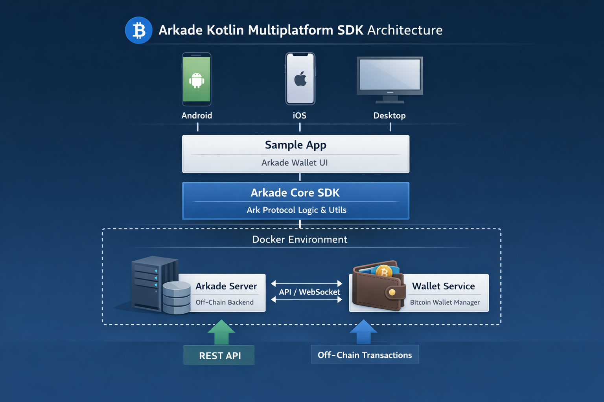

<h1 align="center">Arkade Kotlin Multiplatform SDK</h1>
<p align="center">
<a href="https://github.com/shubertm/arkade-kotlin/actions/workflows/build.yml">

</a>
<a href="https://github.com/shubertm/arkade-kotlin/actions/workflows/unit.yml">

</a>
<a href="https://github.com/shubertm/arkade-kotlin/actions/workflows/e2e.yml">

</a>
</p>

## Overview
**Arkade Kotlin** is an **experimental Kotlin Multiplatform SDK** designed for building **Bitcoin wallets** across Android, iOS, and desktop platforms. It leverages the **Ark Protocol** to enable smooth **off-chain transactions**.  
⚠️ **Note:** This SDK is **not production-ready** and should only be used for experimentation and development purposes.

---

## Features
- **Kotlin Multiplatform support**: Works across Android, iOS, and desktop.
- **Bitcoin wallet integration**: Build wallets with Ark Protocol support.
- **Off-chain transactions**: Enables fast and efficient transfers.
- **Sample app included**: Reference implementation to help developers get started.

---

## Architecture
The repository is organized into the following modules:

| Module | Description |
|--------|-------------|
| **core** | Core Arkade types and utilities for the Ark Protocol. |
| **app** | Sample application demonstrating SDK usage. |
| **buildSrc** | Gradle build configuration and dependencies. |
| **scripts** | Utility scripts for building and running the project. |


<p align="center">

</p>

---

## Getting Started

### Prerequisites
- **Kotlin 1.9+**
- **Gradle 8+**
- **Nigiri** (for integration tests)
- **Docker** (for server and wallet containers)

### Installation
Clone the repository:
```bash
git clone https://github.com/shubertm/arkade-kotlin.git
cd arkade-kotlin
```

Build the project:
```bash
./gradlew build
```

Run the sample app:
```bash
./gradlew :app:run
```

---

## Usage Example
Here’s a simple example of how to initialize the SDK in Kotlin:

**Single Key**
```kotlin
import com.arkade.core.wallet.Wallet
import com.arkade.network.ArkadeClient
import com.arkade.network.ArkadeClientImpl
import com.arkade.network.Config


fun main() = runBlocking {
    val nsec = "<nsec1...>"
    val client: ArkadeClient = ArkadeClientImpl(Config.MUTINYNET)
    val serverInfo = client.getInfo()
    val wallet = Wallet.create(nsec, null, serverInfo)
}
```
**HD**
```kotlin
import com.arkade.core.wallet.Wallet
import com.arkade.network.ArkadeClient
import com.arkade.network.ArkadeClientImpl
import com.arkade.network.Config

fun main() = runBlocking {
    val secret = "abandon abandon abandon abandon abandon abandon abandon abandon abandon abandon abandon about"
    val client: ArkadeClient = ArkadeClientImpl(Config.MUTINYNET)
    val serverInfo = client.getInfo()
    val wallet = Wallet.create(secret, null, serverInfo)
}
```

---

## Contributing
Contributions are welcome!
- Fork the repo
- Create a feature branch
- Submit a pull request

Please note that this project is **experimental**, so expect frequent changes.

---

### Development Environment

#### Setup Pre-commit Hook
```shell
cp scripts/pre-commit .git/hooks/
```

### Testing

#### Unit
```shell
./gradlew testUnit
```
#### Integration
- Install Nigiri
    ```shell
    curl https://getnigiri.vulpem.com | bash
    ```
- Run Nigiri
    ```shell
    nigiri start
    ``` 
- Run all docker e2e tests
    ```shell 
    ./gradlew testE2EDocker
    ```
- Stop Nigiri
    ```shell
    nigiri stop --delete
    ```
---

## License
This project is licensed under the **MIT License**. See the [License](./LICENSE) file for details.

---

## Disclaimer
This SDK is **experimental** and should **not** be used in production environments. Use at your own risk.

---